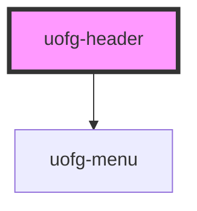

# uofg-header

This component is the main navigation banner that appears at the top of most University of Guelph pages.

## Usage

```html
<uofg-header></uofg-header>
```

### Sub navigation/Page specific content

To add a sub navigation to the header (used to provide page specific content), add child elements to the header defining links and menus.

```html
<uofg-header>
  <a href="#">Example Link 1</a>
  <a href="#">Example Link 2</a>
  <ul data-title="Example Menu">
    <li><a href="#">Example Menu Link 1</a></li>
    <li><a href="#">Example Menu Link 2</a></li>
    <li><a href="#">Example Menu Link 3</a></li>
  </ul>
  <a href="#">Example Link 3</a>
</uofg-header>
```

As can be seen above, links are defined by adding an `a` tag to the header and menus are defined by using a `ul` tag and wrapping links (`a` tags) in a `li` tag. The `ul` tag must have the `data-title` attribute set to whatever the title of the menu should be.

### Department/Topic grouping

Sometimes the header is being used on pages that belong together in a group, or are being used in web pages that belong to a specific department of the University. In these cases the header provides a way to make it clear to the end user that these pages belong together by showing a link to the home page of said department/topic in the sub navigation.

Two attributes are provided to enable this functionality: page-title and page-url (See more info below).

For example, [https://www.uoguelph.ca/convocation](https://www.uoguelph.ca/convocation) has several sub pages that all relate to convocation at University of Guelph. So, the header for these pages could look something like this:

```html
<uofg-header page-title="Convocation" page-url="https://www.uoguelph.ca/convocation">
  <a href="https://www.uoguelph.ca/convocation/faq">FAQs</a>
  <a href="https://www.uoguelph.ca/convocation/contact">Contact Us</a>
</uofg-header>
```

Note that page-title and page-url are meaningless unless sub nav/page specific content is provided.

<!-- Auto Generated Below -->


## Properties

| Property    | Attribute    | Description                                                                                                                                                                                 | Type     | Default |
| ----------- | ------------ | ------------------------------------------------------------------------------------------------------------------------------------------------------------------------------------------- | -------- | ------- |
| `pageTitle` | `page-title` | The title of the department/topic that the header is being used for. For example, for the Convocation pages, this would be set to "Convocation".                                            | `string` | `''`    |
| `pageUrl`   | `page-url`   | The URL to the home/landing page of the department/topic the header is being used for. For example, for the Convocation pages, this would be set to "https://www.uoguelph.ca/convocation/". | `string` | `''`    |


## Dependencies

### Depends on

- [uofg-menu](../uofg-menu)

### Graph


----------------------------------------------

[University of Guelph Web Components](https://github.com/ccswbs/web-components)
