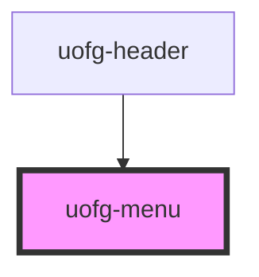

# uofg-menu

This is a utility component, and is meant to be styled by the developer using it. It makes it simpler to make accessible and animated dropdown menus/collapsible content in your pages.

## Usage

This component expects two children within it, a button, and a container which houses the content of the menu.

The button must be an html button tag with the attribute slot="button"

The content container can be any html element but must have the attribute slot="content"

```html
<uofg-menu>
  <button slot="button"></button>
  <div slot="content">
    <span>this</span>
    <span>is</span>
    <span>example</span>
    <span>content</span>
  </div>
</uofg-menu>
```

## CSS Custom Properties

This component uses [CSS Custom Properties](https://developer.mozilla.org/en-US/docs/Web/CSS/Using_CSS_custom_properties) to define the parameters of the animation it plays when expanding or collapsing.

| Property                       | Description                                | Type                                                                                    | Default       |
| ------------------------------ | ------------------------------------------ | --------------------------------------------------------------------------------------- | ------------- |
| --uofg-menu-animation-type     | Determines the animation that is used      | `none`, `slide`, `fade`                                                                 | `none`        |
| --uofg-menu-animation-duration | Determines how long the animation runs for | [CSS Time](https://developer.mozilla.org/en-US/docs/Web/CSS/time)                       | `200ms`       |
| --uofg-menu-animation-easing   | Determines the easing function used        | [CSS Easing Function](https://developer.mozilla.org/en-US/docs/Web/CSS/easing-function) | `ease-in-out` |

<!-- Auto Generated Below -->


## Properties

| Property       | Attribute       | Description                                                                                                                                                                                                                                                                   | Type      | Default |
| -------------- | --------------- | ----------------------------------------------------------------------------------------------------------------------------------------------------------------------------------------------------------------------------------------------------------------------------- | --------- | ------- |
| `autoCollapse` | `auto-collapse` | Controls whether the menu should automatically collapse when the focused element in the page is not contained within the menu (e.g. it's button or content). This is useful for when you want the menu to collapse whenever a user interacts with any other part of the page. | `boolean` | `false` |


## Events

| Event              | Description                                                                                                                                                                                                                                     | Type                   |
| ------------------ | ----------------------------------------------------------------------------------------------------------------------------------------------------------------------------------------------------------------------------------------------- | ---------------------- |
| `animationEnded`   | Dispatched whenever the menu is expanding or collapsing and the animation has ended. This event is not dispatched if the animation is disabled (e.g. due to reduced motion, css variable set to none, or lack of Web Animations API support).   | `CustomEvent<boolean>` |
| `animationStarted` | Dispatched whenever the menu is expanding or collapsing and the animation has started. This event is not dispatched if the animation is disabled (e.g. due to reduced motion, css variable set to none, or lack of Web Animations API support). | `CustomEvent<boolean>` |
| `collapsed`        | Dispatched whenever the menu is collapsed whether by user interaction or programmatically (e.g. collapse()).                                                                                                                                    | `CustomEvent<void>`    |
| `expanded`         | Dispatched whenever the menu is expanded whether by user interaction or or programmatically (e.g. expand()).                                                                                                                                    | `CustomEvent<void>`    |


## Methods

### `collapse() => Promise<void>`

Collapse the menu. This is the same as setting the expanded state to false.

#### Returns

Type: `Promise<void>`

empty Promise.

### `expand() => Promise<void>`

Expand the menu. This is the same as setting the expanded state to true.

#### Returns

Type: `Promise<void>`

empty Promise.

### `getExpanded() => Promise<boolean>`

Get the current expanded state of the menu.

#### Returns

Type: `Promise<boolean>`

A promise which will resolve to the current expanded state.

### `setExpanded(value: boolean) => Promise<void>`

Set the expanded state of the menu.

#### Parameters

| Name    | Type      | Description             |
| ------- | --------- | ----------------------- |
| `value` | `boolean` | The new expanded state. |

#### Returns

Type: `Promise<void>`


### `toggle() => Promise<boolean>`

Toggle the expanded state of the menu.

#### Returns

Type: `Promise<boolean>`

A promise which will resolve to the new expanded state.


## Dependencies

### Used by

 - [uofg-header](../uofg-header)

### Graph


----------------------------------------------

[University of Guelph Web Components](https://github.com/ccswbs/web-components)
