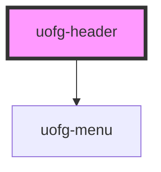

# uofg-header

## Page specific content

To add a page specific nav, add a template component to the header containing links and menus.

Links are generated by adding an `a` tag to the template:

```html
<a href="#">Example Link</a>
```

Menus are generated by using a `ul` tag and wrapping links (`a` tags) in a `li` tag. The `ul` tag must have the `data-title` attribute set to whatever the title of the menu should be.

```html
<ul data-title="Example Menu">
  <li><a href="#">Example Menu Link 1</a></li>
  <li><a href="#">Example Menu Link 2</a></li>
  <li><a href="#">Example Menu Link 3</a></li>
</ul>
```

Putting it all together:

```html
<uofg-header>
  <template>
    <a href="#">Example Link 1</a>
    <a href="#">Example Link 2</a>
    <ul data-title="Example Menu">
      <li><a href="#">Example Menu Link 1</a></li>
      <li><a href="#">Example Menu Link 2</a></li>
      <li><a href="#">Example Menu Link 3</a></li>
    </ul>
    <a href="#">Example Link 3</a>
  </template>
</uofg-header>
```

<!-- Auto Generated Below -->


## Properties

| Property    | Attribute    | Description                                                                                                                                                                      | Type     | Default |
| ----------- | ------------ | -------------------------------------------------------------------------------------------------------------------------------------------------------------------------------- | -------- | ------- |
| `pageTitle` | `page-title` | The title of the pages that the header is being used on. For example, for the Convocation pages, this would be set to "Convocation".                                             | `string` | `''`    |
| `pageUrl`   | `page-url`   | The URL to the home/landing page for the pages the header is being used on. For example, for the Convocation pages, this would be set to "https://www.uoguelph.ca/convocation/". | `string` | `''`    |


## Dependencies

### Depends on

- [uofg-menu](../uofg-menu)

### Graph


----------------------------------------------

*Built with [StencilJS](https://stenciljs.com/)*
